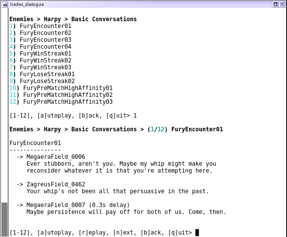

Hades Dialogue Player
=====================

This is an *absurdly* overengineered bit of software with an extremely
specific purpose: to play dialogue files from the game
[Hades, from Supergiant Games](https://www.supergiantgames.com/games/hades/).
Specifically, it focuses on "official" dialogue with character close-ups,
rather than the incidental in-game dialogue which just has subtitles.  It
should be able to play all dialogue you have directly with NPCs throughout
the game, and also the dialogue you get when picking up Boons and the like.
It will also print out the subtitles for the dialogue as it goes, though
it's missing the subtitles for the final post-portrait character response
lines.

[](screenshot.png)

This repo is acutally two separate scripts -- one a basic CLI tool to play
specific dialogues (or a group of dialogues), and another which
provides a console-based interactive session to select and play the
files.

It relies on reading the game's Lua scripts from the install directory,
and also having the game's `VO.fsb` extracted into the component
Ogg files.  [fsb-vorbis-extractor](https://github.com/tmiasko/fsb-vorbis-extractor)
is one tool which can do it, though it requires a few source tweaks
to run properly on Hades' file.  Other FSB extractors may not produce
playable Oggs -- [fsbext](http://aluigi.altervista.org/search.php?src=fsbext)
([github mirror](https://github.com/gdawg/fsbext)), for instance,
won't work.

The utilities use an external media player to actually play the media.
It defaults to [mplayer](https://mplayerhq.hu/) but can be configured
to use anything you like.

Installation
------------

There's no *real* installation here.  Check it out from github and run
it locally.  It requires [Python 3.10+](https://www.python.org/), and
the following third party libraries:

* [appdirs](https://pypi.org/project/appdirs/)
* [inputimeout](https://pypi.org/project/inputimeout/)
* [rich](https://pypi.org/project/rich/)
* [SLPP](https://pypi.org/project/SLPP/)

You can install those via `pip install -r requirements.txt`, or
install them manually.

Then, make sure to have the Hades game `Content/Scripts` directory
available, and extract `Content/Audio/FMOD/Build/Desktop/VO.fsb` (see
"Extracting Audio Files" below for info on that).

**NOTE:** `fsb-vorbis-extractor` extracts the Ogg files with a number
prefix which describes the position they were found inside the FSB
file.  If you use a different extractor which produces different
filenames, this util will have to be updated slightly.  Check the
regular expression `ogg_re` in the `OggLibrary` class inside
`hdialogue/hdialogue.py` and alter to suit.  The symbolic group name
`vo` is the only important one in the regex.

Usage
-----

As mentioned above, there are technically two scripts: one which is
a more traditional CLI util, and the other which is an interactive
console app.  They both share a set of common commandline arguments,
though, in addition to their own.  You can use the `-h`/`--help`
option on either, to see all that's available.  The common arguments
between the two are:

    usage: commmon.py [-h] [--ogg-dir OGG_DIR] [--lua-dir LUA_DIR]
                      [--cache-dir CACHE_DIR]
                      [--media-player MEDIA_PLAYER] [--save-config] [-r]

    Play Hades In-Game Dialogue

    options:
      -h, --help            show this help message and exit
      --ogg-dir OGG_DIR     Directory to find voiceover Ogg dirs (default: /games/
                            Steam/steamapps/common/Hades/Content/Audio/FMOD/Build/
                            Desktop/tmp)
      --lua-dir LUA_DIR     Directory to find the in-game Lua scripts (default:
                            /games/Steam/steamapps/common/Hades/Content/Scripts)
      --cache-dir CACHE_DIR
                            Cache dir to hold LUA->JSON conversions (default:
                            /home/user/.cache/hades_dialogue)
      --media-player MEDIA_PLAYER
                            Media player command to run, to play Oggs. Can include
                            aguments. If the filename to be played can't be the
                            last argument to the command, specify {} as one of the
                            arguments to replace the filename in question at that
                            point. (default: mplayer)
      --save-config         Save the chosen CLI args to the config file (this
                            happens automatically when the app is first run).
                            (default: False)
      -r, --rebuild-cache   Rebuild the cache files (default: False)

The help should be pretty self-explanatory for most of these.  The utilities
convert `NPCData.lua`, `EnemyData.lua`, and `LootData.lua` to a JSON format
that's easier for Python to process, and keeps those conversions in a cache
directory.  If the source files ever change, the cache will need to be rebuilt
(which can be done with the `-r`/`--rebuild-cache` option, or by deleting the
cache dir manually).

The first time the utility runs, it will save all these options to a config
file, which will then be used to set the defaults in the future.  The path
will be shown on the console, but should be `~/.config/hades_dialogue/hades_dialogue.ini`
on Linux systems.  The file will end up looking like:

    [main]
    ogg_dir = /games/Steam/steamapps/common/Hades/Content/Audio/FMOD/Build/Desktop/tmp
    lua_dir = /games/Steam/steamapps/common/Hades/Content/Scripts
    cache_dir = /home/user/.cache/hades_dialogue
    media_player = mplayer

Feel free to edit that file to change the defaults.  Or, if you specify a
different commandline option and wanted it to be permanent, you could add
the `--save-config` argument as well, to tell the app to re-save the
config file using your specified option.  For instance, running the utility
with `--media-player mpv --save-config` would update the `media_player`
line in the INI file.

When using a console media player like mplayer, keyboard controls for
the player should work just fine.  So when using mplayer, hitting `space`
would pause/unpause the playback, or `q` would stop the current cue from
playing and advance to the next (if present).

As the help output indicates, you can add arguments to the player when
using `--media-player` (or editing the config INI).  If the command you'd
like to use to play files doesn't like having the filename as the last
argument, you can use `{}` as a substitute in your media player line.

### `play_cli.py`

This is the "simple" CLI script which just does the specified command and
exits.  Its extra arguments are:

    usage: play_cli.py (-c CHARACTER | -l LOOT | -s | -m) [-w WHICH]

    Play Hades In-Game Dialogue (CLI Version)

    options:
      -n NPC, --npc NPC     Play dialogue from the specified NPC (default: None)
      -e ENEMY, --enemy ENEMY
                            Play dialogue from the specified enemy (default: None)
      -l LOOT, --loot LOOT  Play dialogue from the specified loot (default: None)
      -s, --show            Show all NPC/Enemy/Loot IDs (default: False)
      -m, --magic           Do "magic" hardcoded actions (default: False)
      -w WHICH, --which WHICH
                            Play the specified dialogue ID from inside the
                            specified npc/enemy/loot. To get a list of available
                            IDs, specify `list`. (default: None)

The `-s`/`--show` option will show you the available NPC + enemy + loot
names to use.  You can plug those values into the `-n`/`--npc`,
`-e`/`--enemy`, or `-l`/`--loot` arguments to loop through all dialogue for the
specified character or loot (Boon) pickup.  Rather than playing *all* the
dialogue, you could instead choose a particular one with `-w`/`--which`.  You
can use the special keyword `list` to show all possible options.  For instance,
to show all options for Hermes boons:

    $ ./play_cli.py -l HermesUpgrade -w list

The `-m`/`--magic` option isn't generally useful; it's just a remnant
of my initial development where I had a list of operations hardcoded in
the app.  I left it in just in case I feel like playing around with things
in the future.

### `play_interactive.py`

This script provides a console-based interactive way to listen to the
various dialogue.  It's got a couple of additional arguments on top of
the common set:

    usage: play_interactive.py [-c COLUMNS] [-m MIN_ROWS]

    Play Hades In-Game Dialogue (Interactive Console Version)

    options:
      -c COLUMNS, --columns COLUMNS
                            Columns to use when showing options (default: 3)
      -m MIN_ROWS, --min-rows MIN_ROWS
                            Minimum rows before columns get used (default: 15)

The options merely control how to display menus where there are a lot
of options.  The default is to show up to 3 columns, and require a minimum
of 15 items per column before adding another.  So 1-15 choices will be in a
single column, 16-30 will use 2, and any more than that will use 3.  These
options will be saved in the `hades_dialogue.ini` config file as well,
like the common options:

    [play_interactive]
    columns = 3
    min_rows = 15

The usage should be pretty straightforward:

    $ ./play_interactive.py

    Choose a Category:
    1) NPCs
    2) Enemies
    3) Loot

    [1-3], [q]uit> 3

    Loot
    1) AphroditeUpgrade
    2) AresUpgrade
    3) ArtemisUpgrade
    4) AthenaUpgrade
    5) DemeterUpgrade
    6) DionysusUpgrade
    7) HermesUpgrade
    8) PoseidonUpgrade
    9) TrialUpgrade
    10) ZeusUpgrade

    [1-10], [b]ack, [q]uit> 1

    Loot > AphroditeUpgrade
    1) Pickups
    2) Duos
    3) Bought
    4) Gifts
    5) Priorities
    6) Super Priorities
    7) Rejections
    8) Makeups

    [1-8], [b]ack, [q]uit> 1

    Loot > AphroditeUpgrade > Pickups
    1) AphroditeFirstPickUp    16) AphroditeMiscPickup15  31) AphroditeMiscPickup30
    2) AphroditeMiscPickup01   17) AphroditeMiscPickup16  32) AphroditeMiscPickup31
    3) AphroditeMiscPickup02   18) AphroditeMiscPickup17  33) AphroditeMiscPickup32
    4) AphroditeMiscPickup03   19) AphroditeMiscPickup18  34) AphroditeMiscPickup33
    5) AphroditeMiscPickup04   20) AphroditeMiscPickup19  35) AphroditeMiscPickup34
    6) AphroditeMiscPickup05   21) AphroditeMiscPickup20  36) AphroditeMiscPickup35
    7) AphroditeMiscPickup06   22) AphroditeMiscPickup21  37) AphroditeMiscPickup36
    8) AphroditeMiscPickup07   23) AphroditeMiscPickup22  38) AphroditeMiscPickup37
    9) AphroditeMiscPickup08   24) AphroditeMiscPickup23  39) AphroditeMiscPickup38
    10) AphroditeMiscPickup09  25) AphroditeMiscPickup24  40) AphroditeMiscPickup39
    11) AphroditeMiscPickup10  26) AphroditeMiscPickup25  41) AphroditeMiscPickupRare01
    12) AphroditeMiscPickup11  27) AphroditeMiscPickup26  42) AphroditeMiscPickupRare02
    13) AphroditeMiscPickup12  28) AphroditeMiscPickup27  43) AphroditeMiscPickupRare03
    14) AphroditeMiscPickup13  29) AphroditeMiscPickup28  44) AphroditeMiscPickupRare04
    15) AphroditeMiscPickup14  30) AphroditeMiscPickup29

    [1-44], [a]utoplay, [b]ack, [q]uit> 1

    Loot > AphroditeUpgrade > Pickups > (1/44) AphroditeFirstPickUp

    AphroditeFirstPickUp
    --------------------
      -> ZagreusField_0782
         I must be a mess, let's see here. Hi there! In the name of Hades!
         Olympus, I accept this message.

      -> Aphrodite_0010
         Why hello, hello, there, little godling. I have to say you're
         quite the specimen, and so, I've decided I shall aid you for the
         moment. You interested?

    [1-44], [a]utoplay, [r]eplay, [n]ext, [b]ack, [q]uit>

Choosing `a` (for "autoplay") will loop over all audio files in the current
section (starting from the one after your current dialogue, if you've already
listened to one).  When autoplaying, there'll be a 2-second break inbetween
each dialogue -- hit Enter during this time to break out of autoplay (it will
prompt you to do so).

`n` and `p` can be used to manually go the next or previous one, and `r` can
be used to replay the one you just listened to.  `b` is used to back up to
the previous menu.  `q` can be used to quit, though of course more drastic
measures like `Ctrl-C` will also work.

Extracting Audio Files
----------------------

As mentioned above, the game's `VO.fsb` file (in `Content/Audio/FMOD/Build/Desktop`),
needs to be extracted to get access to the actual Ogg files.
[fsb-vorbis-extractor](https://github.com/tmiasko/fsb-vorbis-extractor)
is one project which can do so, though it requires a few tweaks to the
source -- a few files in `VO.fsb` end up tripping assertions in the code.

First, line 162 of `src/fsb/container.cpp` needs to be commented -- there's
apparently a header in this FSB which the util doesn't know about, and
its presence prevents the app from doing anything with the file.
Commenting the line doens't appear to cause any problems for extracting
the file, though:

```patch
diff --git a/src/fsb/container.cpp b/src/fsb/container.cpp
index e58daf8..41f46a2 100644
--- a/src/fsb/container.cpp
+++ b/src/fsb/container.cpp
@@ -159,7 +159,7 @@ sample container::read_sample_header(io::buffer_view & view) {
         view.skip(extra_length);
         break;
       default:
-        CHECK(false) << "Unexpected extra header type: " << type;
+        //CHECK(false) << "Unexpected extra header type: " << type;
         view.skip(extra_length);
     }
   }
```

Secondly, line 125 of `src/fsb/vorbis/rebuilder.cpp` does some CRC32
checking on some Vorbis-specific headers.  The check fails when trying to
extract a handful of files inside the archive, and when it does so, it
interrupts the rest of the extraction process.  Commenting out the check
allows the extraction process to continue to other files.  The affected
files end up sounding completely distorted, so clearly the check knows
what it's talking about, but the impact of not having these eight files
is pretty minor.  The patch in question:

```patch
diff --git a/src/fsb/vorbis/rebuilder.cpp b/src/fsb/vorbis/rebuilder.cpp
index 1f57929..0926155 100644
--- a/src/fsb/vorbis/rebuilder.cpp
+++ b/src/fsb/vorbis/rebuilder.cpp
@@ -122,8 +122,8 @@ void rebuilder::rebuild_headers(

   const auto i =
     std::lower_bound(headers, headers_end, crc32, headers_info_crc32_less());
-  CHECK(i != headers_end && i->crc32 == crc32)
-    << "Headers with CRC-32 equal " << crc32 << " not found.";
+  /*CHECK(i != headers_end && i->crc32 == crc32)
+    << "Headers with CRC-32 equal " << crc32 << " not found.";*/

   rebuild_id_header(channels, rate, i->blocksize_short, i->blocksize_long, id);
   rebuild_comment_header(comment, loop_start, loop_end);
```

Here's the files which are affected by this:

* `Charon_0032` - On-hit cue when Charon gets damaged, saying *"Hmmmm....!"*
* `Charon_0038` - Occurs during Charon's `CharonAboutHermes03`,
  `CharonPostEnding02`, `BossCharonEncounter01`, and
  `BossCharonAboutHermesQuest01` dialogues:
  *"Mmnnn{#DialogueItalicFormat}rraaauuugggghhh{#PreviousFormat}!!"*
* `Intercom_0097` - In `SurvivalEncounterStartVoiceLines`, Hades saying
  *"You dare?"*
* `Intercom_0312` - In `PerfectClearEncounterFailedVoiceLines`, Hades
  saying *"Aww.'*
* `Intercom_0419` - In `SurvivalEncounterSurvivedVoiceLines`, Hades
  saying *"All right, break it up!"*
* `Intercom_0857` - In `PerfectClearEncounterQuicklyFailedVoiceLines`,
  Hades saying *"Hah, haha."*
* `Nyx_0255` - Occurs in Megaera's `MegaeraWithNyx04` conversation,
  Nyx replying *"Mmm."* at the end.
* `Tisiphone_0075` - Not actually used in-game anywhere; commented out
  from Tisiphone's `CauseOfDeathVoiceLines` in the game data.

Of those eight, only two (`Charon_0038` and `Nyx_0255`) actually show up
as playable dialogue in this project.

TODO
----

(Honestly, anything in here is supremely unlikely to ever actually
happen.)

* I very nearly started working on a proper GUI version of this
  (via PyQt, most likely), but thankfully came to my senses.
* The `hdialogue` library isn't really *properly* isolated; it
  assumes console interactions in a variety of ways.

License
-------

Hades Dialogue Player is licensed under the
[New/Modified (3-Clause) BSD License](https://opensource.org/licenses/BSD-3-Clause).
A copy is also found in [COPYING.txt](COPYING.txt).

Changelog
---------

**2022-06-10**
 - Added in some missing chars: Skelly, Thanatos-in-the-field, and
   Cerberus-in-the-field.

**2022-06-05**
 - Initial Release

